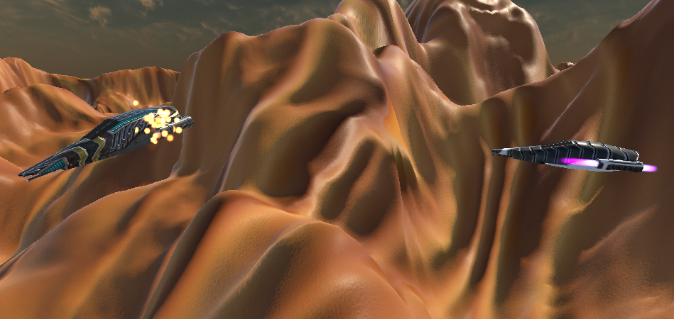

# BotShipController

AI controller for NPC ships in Unity.  
Implements a finite state machine with multiple behaviors: **Patrol, Chase, Attack, BreakOff, Evade**.

## ✨ Features
- Finite State Machine with 5 states:
  - **Patrol**: random roaming within a radius
  - **Chase**: pursuit of visible player targets
  - **Attack**: strafing around the target and firing projectiles
  - **BreakOff**: disengage maneuver after prolonged attack
  - **Evade**: evasive action when taking damage
- Nitro system with drain, recharge, and particle effects
- Weapon overheating and cooldown mechanics
- Separation logic to avoid collisions with the target
- Configurable ranges, speeds, and timers
- Debug gizmos for all ranges (Patrol, Detection, Chase, Attack, BreakOff, Separation)
- Editor HUD showing current bot state

## 📂 Dependencies
- `ShipHealth.cs` (for damage detection and health management)
- Projectile prefab with **Rigidbody** + **Collider**
- A `firePoint` transform (for projectile spawning and aiming)
- ParticleSystems for nitro effects (optional)

## 🛠 Setup
1. Attach `BotShipController.cs` and `ShipHealth.cs` to your ship prefab.
2. Assign references in the Inspector:
   - `firePoint` (Transform)
   - `projectilePrefab` (GameObject with Rigidbody + Collider)
   - Nitro particle systems (optional)
3. Tag player objects with **"Player"** so the bot can detect them.
4. Adjust ranges, speeds, and timers to fit your gameplay.

## 📸 Screenshots
  

## 📜 License
This project is licensed under the terms of the repository’s main [LICENSE](../../LICENSE).
